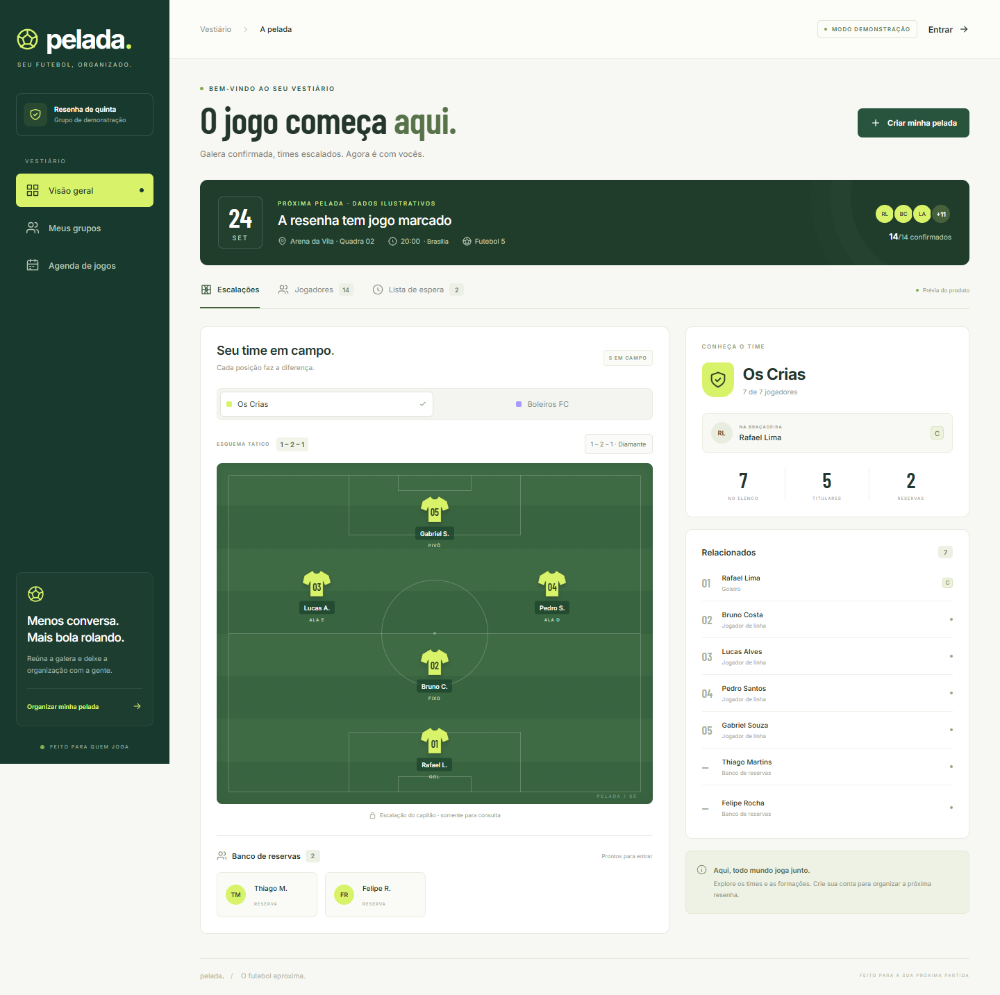

# pelada. ⚽

**Seu jogo começa aqui.** Aplicação full stack para organizar futebol entre amigos, confirmar presenças e montar times em um campo interativo.



## O que você pode fazer

- Criar uma conta e grupos privados, compartilhando convites por link.
- Marcar peladas com local, data, quantidade de times e limite de jogadores.
- Confirmar presença ou entrar em uma fila de espera com promoção automática.
- Definir capitães; cada capitão escolhe seu elenco entre os jogadores disponíveis.
- Escalar um goleiro e quatro jogadores de linha nas formações **2–2**, **1–2–1** e **3–1**.
- Arrastar jogadores entre posições e banco ou usar o seletor acessível por toque e teclado.
- Consultar uma demonstração pública com dados fictícios, sem cadastro.

Reservas já têm vaga na pelada e pertencem a um time. A lista de espera é para quem ainda não tem vaga no evento.

## Tecnologias

| Camada | Tecnologia |
| --- | --- |
| Backend | Java 21, Spring Boot 4.1.1, Spring Security, JPA/Hibernate |
| Frontend | Angular 21.2 LTS, TypeScript, componentes standalone e signals |
| Persistência | PostgreSQL, Flyway, Spring Session JDBC |
| Verificações | JUnit, AssertJ, Playwright, PostgreSQL real |
| Publicação | Docker, Render Free e Neon Free |

O frontend de produção é servido pelo próprio Spring Boot. Assim, navegador, sessão e API compartilham a mesma origem. Não são necessários microsserviços, Redis nem uma API de futebol externa.

## Executar com Docker

Pré-requisito: Docker com Compose.

```sh
docker compose up --build
```

Abra **http://localhost:8080**. O banco e o aplicativo ficam acessíveis apenas na máquina local. O Compose mantém os dados em um volume PostgreSQL.

A página inicial é uma demonstração somente para consulta. Clique em **Criar minha pelada** para cadastrar uma conta e começar seu próprio grupo. Não existem senhas públicas para os jogadores fictícios.

```sh
docker compose down
```

Esse comando encerra os serviços sem apagar os dados.

## Desenvolvimento sem Docker para a aplicação

Requer Java 21, Maven 3.9+, Node.js 24, pnpm 11.19.0 e PostgreSQL 18. O backend também foi testado com PostgreSQL 18.4.

1. Crie um banco `pelada` e um usuário com permissão de criação de tabelas.
2. Configure `JDBC_DATABASE_URL`, `DB_USER` e `DB_PASSWORD` no terminal. O arquivo `.env.example` documenta as variáveis; o Spring não carrega `.env` automaticamente.
3. Inicie o backend:

```sh
mvn -f backend/pom.xml spring-boot:run
```

4. Em outro terminal:

```sh
cd frontend
pnpm install --frozen-lockfile
pnpm start
```

Abra **http://localhost:4200**. O proxy de desenvolvimento encaminha `/api` ao backend na porta 8080.

Para gerar o pacote com frontend e backend juntos, execute nesta ordem:

```sh
cd frontend
pnpm build
cd ..
mvn -f backend/pom.xml package -DskipTests
java -jar backend/target/pelada-1.0.0.jar
```

Encerre o processo Java antes de reconstruir o mesmo arquivo JAR no Windows.

## Como experimentar o fluxo completo

1. Cadastre-se, crie um grupo e copie o convite.
2. Marque uma pelada para uma data futura. O padrão é dois times de sete pessoas.
3. Em outro navegador ou janela anônima, cadastre uma segunda pessoa e entre pelo convite.
4. Confirme a presença das duas contas.
5. Como organizador, abra **Configurar time e capitão** e escolha alguém confirmado.
6. Como capitão, use **Disponíveis** para adicionar jogadores. Depois toque em uma posição do campo e escolha um nome.
7. Troque a formação, mova jogadores ao banco e recarregue a página: as alterações permanecem salvas.

O organizador só edita a escalação se também for o capitão daquele time. Trocar o capitão não remove o capitão anterior do elenco; o novo capitão pode liberá-lo. Um capitão que desiste deixa o posto vago até o organizador indicar um substituto.

## Testes

Crie um banco **exclusivo para testes**, chamado `pelada_test`, e configure as variáveis abaixo. Os testes limpam as tabelas desse banco a cada cenário; nunca aponte `TEST_DATABASE_URL` para o banco que contém seus dados.

```text
TEST_DATABASE_URL=jdbc:postgresql://localhost:5432/pelada_test
TEST_DB_USER=pelada
TEST_DB_PASSWORD=pelada
```

```sh
mvn -f backend/pom.xml test
```

Com a aplicação completa executando em `http://127.0.0.1:8080`:

```sh
cd frontend
pnpm exec playwright install chromium
pnpm test:e2e
```

`BASE_URL` permite apontar os testes para outra instância. Para usar o Chrome já instalado, configure `PLAYWRIGHT_CHANNEL=chrome`.

Os testes de navegador criam contas e grupos fictícios. Execute-os em uma instância de desenvolvimento. A integração contínua usa bancos separados para regras e testes de navegador.

**Verificado em 22/09/2026:** 12 testes de integração Java e 3 cenários Playwright passaram. Consulte [o relatório de validação](docs/VALIDACAO.md).

## Organização e decisões

```text
backend/     Aplicação Java e migrações SQL
frontend/    Interface Angular e testes de navegador
docs/        Arquitetura, publicação e imagens reais da aplicação
```

- [Arquitetura e regras de concorrência](docs/ARQUITETURA.md)
- [Publicar no Render com Neon](docs/PUBLICACAO.md)
- [Documentação interativa da API, quando executando](http://localhost:8080/api/docs)
- [OpenAPI JSON, quando executando](http://localhost:8080/api/openapi)
- [Tela em celular](docs/screenshots/mobile.png)

## Estado da entrega

Código implementado, compilado e validado localmente. Configurações de Docker, Render e integração contínua estão incluídas. **Ainda não publicado:** faltam as contas do proprietário no Render e no Neon, as credenciais do banco e um repositório remoto conectado ao Render. A imagem Docker e o fluxo remoto de CI não foram executados nesta máquina, que não possui Docker.

Na primeira versão ficam de fora pagamentos, custos, estatísticas de partidas, chat, recorrência de eventos, recuperação de senha e notificações externas. Os convites são compartilhados copiando o link; não existe integração com WhatsApp.
