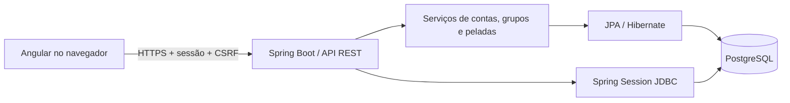

# Arquitetura

## Fluxo de dados

O backend organiza as funcionalidades em `auth`, `groups`, `games`, `demo` e `api`. As entidades compartilhadas ficam em `domain`. Os controladores recebem contratos validados e devolvem modelos de leitura; nunca serializam entidades JPA ou hashes de senha.

O Angular usa componentes standalone, signals para estado derivado e rotas por fragmento (`#groups`, `#group/UUID`, `#game/UUID`, `#invite/UUID`). Isso permite recarregar qualquer tela no mesmo endereço servido pelo Spring, sem regras de redirecionamento no host. A atualização de presença e elencos acontece a cada 15 segundos enquanto a página da pelada está visível e sem edição em andamento.

## Modelo

| Entidade | Responsabilidade |
| --- | --- |
| Player | Identidade, e-mail normalizado e hash BCrypt |
| Club / Member | Grupo privado, organizador, convite e participantes |
| Game | Evento, horário, capacidade e cancelamento |
| Participation | Confirmação/fila, ordem de inscrição, time e posição |
| Team | Identidade, capitão, formação e revisão da escalação |
| Spring Session | Sessão autenticada e token CSRF persistidos no banco |

A escalação é representada pela formação do time e pelo `slot` de cada participação. `slot = 0` é goleiro; `1..4` são jogadores de linha; `null`, quando existe time, significa reserva. Não é preciso criar uma tabela adicional para esse conjunto de cinco posições.

## Consistência e concorrência

Todas as alterações de uma pelada adquirem um bloqueio transacional `PESSIMISTIC_WRITE` na linha do evento. A confirmação só conta vagas depois de adquirir esse bloqueio. Duas requisições disputando a última vaga são processadas em sequência: uma entra; a outra vai para a fila.

O mesmo bloqueio protege escolhas dos capitães, desistências, promoção da fila e mudanças na escalação. Uma participação tem apenas um `team_id`. A ordem da fila é o identificador sequencial da inscrição, gerado dentro dessa operação serializada. Desistir e entrar novamente coloca a pessoa no fim da fila.

O banco reforça as regras com:

- Unicidade de `(game_id, player_id)` para evitar inscrições duplicadas.
- Unicidade de `(team_id, slot)` para evitar duas pessoas na mesma posição.
- Chave estrangeira composta para impedir associação a time de outra pelada.
- Restrições para impedir posições fora de `0..4`, fila com time ou posição sem time.
- Um mesmo capitão não pode liderar dois times na mesma pelada.

Trocas entre posições primeiro liberam os slots e fazem `flush`, para então aplicar a nova escalação dentro da mesma transação. Se houver erro, a transação inteira é revertida. Uma revisão incremental do time, enviada pelo cliente, rejeita salvamentos de uma escalação antiga com HTTP 409.

Capacidade: `quantidade de times × jogadores por time`. De dois a seis times, com cinco a doze pessoas por elenco. O limite de cinco titulares é fixo, independentemente do tamanho do banco.

## Permissões e segurança

- Grupo e evento exigem associação verificada no servidor, mesmo quando o usuário conhece um UUID.
- Organizador cria eventos, nomeia capitães e cancela peladas.
- Capitão escolhe e libera jogadores, define formação e escala apenas o próprio time.
- Participante confirma/desiste da própria presença e consulta os times.
- Demonstração pública aceita somente leitura; senhas dos perfis fictícios são desabilitadas.
- Uma pelada iniciada bloqueia inscrições, desistências, escalações e configuração de times. O cancelamento pelo organizador continua disponível.
- Sessões são persistidas por Spring Session JDBC; login troca o identificador da sessão e invalida o token CSRF anterior. Logout invalida a sessão.
- A API exige token CSRF também em login e cadastro. O cliente busca um token pela sessão em `/api/auth/csrf`.
- Cookie `HttpOnly`, `SameSite=Lax` e `Secure` na configuração de publicação. O frontend não armazena tokens de autenticação no navegador.
- A política de conteúdo permite scripts apenas da mesma origem. Fontes são incluídas no pacote. O build desativa o carregamento de CSS por manipulador inline para respeitar essa política.

## Contratos HTTP

| Método e rota | Resultado |
| --- | --- |
| `GET /api/auth/csrf` | Token e nome do cabeçalho CSRF |
| `POST /api/auth/register` | Cadastro, sem autenticação automática |
| `POST /api/auth/login` | Sessão autenticada e perfil |
| `GET /api/auth/me` / `POST /api/auth/logout` | Perfil / encerramento de sessão |
| `GET, POST /api/groups` | Lista de grupos do usuário / criação |
| `POST /api/invites/{invite}/join` | Entrada idempotente no grupo |
| `GET, POST /api/groups/{id}/games` | Agenda / criação de pelada |
| `GET /api/games/{id}` | Evento, grupo, participantes e times |
| `POST, DELETE /api/games/{id}/attendance` | Confirmar / desistir |
| `POST /api/games/{id}/cancel` | Cancelar evento |
| `PUT /api/games/{game}/teams/{team}` | Nome, cor e capitão |
| `POST /api/games/{game}/teams/{team}/players` | Escolher jogador disponível |
| `DELETE /api/games/{game}/teams/{team}/players/{player}` | Liberar jogador do elenco |
| `PUT /api/games/{game}/teams/{team}/lineup` | Formação, cinco slots e revisão |
| `GET /api/demo` | Exemplo público somente para consulta |

Datas da API são instantes UTC. A criação interpreta o horário local do dispositivo, informado ao usuário; a consulta identifica os horários de Brasília. O servidor é a autoridade para decidir se a pelada começou.

Erros conhecidos usam `{ "message": "mensagem em português" }`: 400 para entrada inválida, 401 para ausência de sessão, 403 para permissão, 404 para recurso ausente e 409 para conflito. O cliente atualiza a pelada ao receber conflito.

## Demonstração

A inicialização cria um grupo, dois times e dezesseis jogadores fictícios: catorze confirmados, dos quais dez titulares, e dois na espera. Não existe senha para entrar nesses perfis. O endpoint público mostra uma próxima quinta-feira ilustrativa e nunca altera o banco em uma consulta GET. O selo de demonstração distingue esses dados dos eventos reais.
