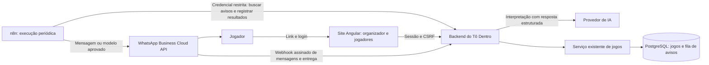

# Plano de implementação — assistente e WhatsApp

Data: 08/10/2026. Estado: proposta de implementação; nenhuma integração ativada.

Atualização de 08/10/2026: a primeira etapa (assistente dentro do site) foi implementada
com integração configurável de IA, revisão e confirmação. Consulte
[ASSISTENTE.md](ASSISTENTE.md) para ativação e limites. WhatsApp e n8n permanecem
nas próximas etapas; nenhuma mensagem real foi ativada.

## Objetivo e primeira versão

Permitir que o organizador crie uma pelada por texto dentro do Tô Dentro e envie convites e lembretes individuais pelo WhatsApp. Reutilizar criação de jogos, permissões, presença, fila e recorrência existentes.

Primeira versão:

- Assistente no contexto de um grupo, disponível ao organizador.
- Pedido em português → esclarecimentos necessários → resumo editável → confirmação → criação.
- Número de WhatsApp verificado e autorização de recebimento por jogador e grupo.
- Convite após a criação, mediante opção explícita do organizador, com link para o jogo.
- Lembrete configurável antes do jogo; proposta inicial: duas horas antes, para confirmados.
- Consulta do estado dos envios e opção de desligar as automações.

Os jogadores confirmam presença no site nesta versão. Comandos e presença pelo WhatsApp entram depois do piloto. Áudio, cobranças, edição/cancelamento pela IA, montagem de times e operações financeiras ficam para outra etapa. Jogos criados pelo formulário também podem usar as notificações.

## Base existente e decisões de arquitetura

- Angular standalone, signals e CSS próprio; Spring Boot, PostgreSQL e Flyway.
- Navegador acessa apenas o backend da mesma origem, com sessão e CSRF.
- `Games.create` já exige organizador, data futura e parâmetros válidos; capacidade é quantidade de times × jogadores por time.
- Cada grupo tem fuso horário; recorrências preparam uma janela de oito jogos futuros sob demanda.
- Contas atualmente possuem nome, e-mail e senha, sem telefone.
- O lembrete financeiro atual apenas abre `wa.me` com texto preenchido.

Arquitetura proposta:

O backend é a fonte dos jogos, destinatários e permissões. O n8n não acessa tabelas de domínio, não recebe senha de administrador e não decide quem pode criar jogos. No MVP, a interpretação de IA fica no backend; o n8n organiza os envios. Isso também permite trocar o n8n por outro executor sem alterar as regras do produto.

## Etapa 0 — configuração e decisões externas

Entregas:

- Definir um número remetente do Tô Dentro e configurar a conta e o aplicativo Meta para WhatsApp Business Platform, começando com ambiente de teste.
- Preparar modelos em português para convite e lembrete, submetidos à aprovação da Meta. Não presumir classificação, aprovação ou custo antes da análise.
- Escolher hospedagem do n8n e do backend que permita execução contínua, HTTPS e armazenamento persistente.
- Escolher provedor/modelo de IA com saída estruturada, limites de uso e credenciais apenas no servidor. A arquitetura deve permitir substituição.
- Separar ambientes de teste e produção, números destinatários e credenciais; definir teto de gastos antes do piloto.

O `render.yaml` do repositório usa plano gratuito. Serviços web gratuitos do Render suspendem após 15 minutos sem tráfego; um agendador apenas dentro desse processo não oferece lembretes pontuais. Confirmar a hospedagem efetivamente usada e preparar serviço contínuo para a operação. Não prometer horário de envio antes dessa validação.

Critério de conclusão: ambiente de teste recebe e envia uma mensagem para um destinatário autorizado; dependências para produção estão identificadas. Esta configuração pode avançar enquanto o assistente é desenvolvido.

## Etapa 1 — assistente para criar jogos no site

Entregas:

- Abrir o assistente a partir do grupo do organizador, mantendo visível qual grupo receberá o jogo.
- Implementar interpretação estruturada com campos permitidos: título, local, data, horário, fuso, times, jogadores por time e recorrência semanal com término opcional.
- Informar contexto mínimo: horário atual, fuso e dados autorizados do grupo. Não enviar membros, cobranças ou comprovantes ao modelo.
- Usar padrões visíveis do formulário existente quando apropriado. Para local ausente, referências como “de sempre” sem configuração ou parâmetros incompatíveis, pedir esclarecimento.
- Converter “amanhã” e “sábado” no fuso do grupo e mostrar data absoluta. Se o pedido ficar ambíguo, esclarecer antes de criar.
- Mostrar resumo editável, inclusive capacidade, recorrência e efeitos de cobrança do formulário; exigir ação explícita “Criar jogo”. A interpretação isolada não grava jogos nem dispara mensagens.
- Guardar proposta com autor, grupo, validade e estado; alterações geram uma versão nova. A confirmação envia a referência da proposta, não parâmetros arbitrários definidos pelo modelo.
- Confirmar pelo serviço `Games.create`, revalidando permissão e data naquele momento. Consumir a proposta e registrar o jogo na mesma transação.
- Tratar confirmação repetida como a mesma operação: retornar o jogo já criado. Sugerir conferência de jogos próximos para evitar duplicação por pedidos distintos, sem proibir automaticamente dois jogos válidos no mesmo horário.
- Limitar tamanho do pedido, frequência, tempo e custo. Em falha da IA, oferecer o formulário já existente.

Contratos sugeridos, sujeitos à revisão na implementação:

| Rota | Responsabilidade |
| --- | --- |
| `POST /api/groups/{id}/assistant/proposals` | Interpretar pedido ou complemento, com sessão e CSRF |
| `PUT /api/assistant/proposals/{id}` | Revisar campos e gerar nova versão validada |
| `POST /api/assistant/proposals/{id}/confirm` | Confirmar versão, criar uma vez e devolver jogo |

Critério de conclusão: um organizador cria jogo avulso e série semanal pelo assistente; membro comum não consegue criar; data/local ambíguos exigem esclarecimento; repetir a confirmação não duplica o jogo. O formulário permanece disponível.

## Etapa 2 — vínculo do WhatsApp e preferências

Entregas:

- Adicionar número normalizado no padrão internacional, status de verificação e vínculo exclusivo a uma conta.
- Verificação proposta: usuário autenticado gera código temporário de uso único e abre conversa com o número oficial. O webhook assinado associa o remetente que enviou o código à conta. Apenas informar um telefone não comprova sua posse.
- Limitar tentativas, expiração e reenvio; trocar número invalida o vínculo anterior. Revalidar vínculo para mudanças sensíveis e permitir desconectar o canal.
- Registrar autorização explícita por grupo e tipo de aviso, com data e versão do texto aceito. Verificação e consentimento são ações distintas.
- Permitir desativar pelo site e por mensagem “SAIR”. Na primeira versão, “SAIR” suspende globalmente os avisos desse número e informa como ajustar preferências no site.
- Exibir números mascarados quando houver necessidade de consulta administrativa; não publicar telefones nas listas de membros.
- Atualizar a política de privacidade, explicar finalidade e fornecedores e definir retenção de propostas, mensagens, resultados e logs.

Critério de conclusão: número não verificado ou sem autorização não recebe convite; revogação, saída do grupo e troca de número invalidam avisos ainda pendentes; código repetido ou vencido não vincula conta.

## Etapa 3 — fila persistente e fluxos n8n

Entregas no backend:

- Criar fila de notificações no PostgreSQL. Gravar intenção de aviso na mesma transação da criação do jogo, incluindo jogos criados pelo formulário.
- Usar chave única por jogo, pessoa, tipo de aviso e revisão relevante para impedir agendamentos duplicados.
- Persistir estados de agendamento, tentativa, aceitação pelo provedor, entrega, falha, cancelamento e resultado desconhecido. Aceitação pela API não significa entrega ao jogador.
- Entregar lotes com reserva temporária e limite de concorrência ao n8n; registrar resultado e identificador da Meta.
- Revalidar jogo ativo, horário, participação no grupo, telefone e autorização imediatamente antes do envio.
- Em mudança de horário/local, invalidar avisos antigos e recalcular pendentes; em cancelamento, remover convites e lembretes pendentes. Avisos sobre alteração/cancelamento para quem já foi notificado precisam de modelos próprios antes de habilitar esses eventos no piloto.
- Para séries, não enviar oito convites de uma vez. Proposta inicial: convocação de cada ocorrência até sete dias antes, ou imediata se mais próxima. Completar a janela de recorrências com tarefa periódica autorizada, sem depender de alguém abrir a agenda.
- Não enviar avisos vencidos após indisponibilidade. Adotar validade por tipo, tentativas limitadas e respeito a limites de envio do provedor.
- Falha com resposta explícita pode permitir nova tentativa; timeout após submissão deve ficar como resultado desconhecido para reconciliação. Não prometer entrega exatamente uma vez, nem reenviar cegamente quando a Meta pode já ter aceitado.

Entregas n8n:

- Workflow periódico consulta avisos elegíveis, envia pelo nó oficial WhatsApp Business Cloud e registra resultado por item.
- Tratar erros individuais, limites, tentativas e indisponibilidade sem perder o lote. O banco do aplicativo mantém o estado durável.
- Exportar workflow sem segredos para o repositório e documentar instalação, credenciais, frequência e recuperação.
- Credencial de integração revogável, com escopo apenas para reservar notificações e registrar resultados. Não aceitar um `userId` informado pelo workflow como autorização para ações de jogador ou admin.
- Receber webhooks da Meta no backend, validar assinatura sobre corpo original, persistir e deduplicar eventos antes de responder. Processar verificação de número, “SAIR” e estados de entrega. As demais mensagens recebem orientação para o site nesta versão.
- Manter sessão/CSRF nas APIs do navegador; separar autenticação das rotas de integração e dos webhooks, sem liberar toda a API nem desativar CSRF globalmente.

Critério de conclusão: jogo criado pelo assistente ou formulário pode gerar convite e lembrete; execução ou webhook repetido não gera nova intenção; jogo cancelado e consentimento revogado são respeitados; reinício preserva pendências; falhas ficam visíveis.

## Etapa 4 — piloto e liberação

Começar em um único grupo com destinatários voluntários, limites de volume e botão para suspender todos os envios. Conferir custos e entrega antes de expandir.

Verificações obrigatórias:

- Testes de backend com PostgreSQL: permissões, propostas expiradas/consumidas, concorrência, consentimento, deduplicação, reserva de lotes, reprogramação e recorrência sem acesso à agenda.
- Testes com provedor simulado: falha explícita, timeout incerto, limite de envio, eventos repetidos/fora de ordem e recuperação após reinício.
- Testes do webhook: assinatura inválida, código reutilizado, “SAIR”, número desvinculado e estados sem destinatário autorizado.
- Navegador em desktop e celular: criar, revisar, confirmar, verificar número, configurar avisos e consultar falhas. Teclado, foco visível, toque, estados de espera/erro e movimento reduzido.
- Teste real com número de teste: modelo aprovado, link para jogo e login, recebimento de estados e opt-out. Registrar evidência sem expor dados ou credenciais.
- Regressão das regras existentes de presença, fila, recorrência, financeiro e partida ao vivo.

Critério de liberação: fluxos principais funcionam no piloto, falhas são recuperáveis e observáveis, gastos estão dentro do teto definido e existe procedimento de pausa/recuperação. WhatsApp desligado não impede criar jogos e confirmar pelo site.

## Etapa 5 — comandos e presença pelo WhatsApp

Após o piloto:

- Admin verificado pode solicitar criação por conversa, usando a mesma proposta e confirmação. Resolver grupo explicitamente quando houver mais de um.
- Jogador verificado pode consultar o próximo jogo e confirmar/desistir da própria presença. Havendo mais de um jogo possível, pedir escolha antes de alterar.
- Reutilizar `Games` e as permissões reais; uma mensagem não concede acesso a grupos nem altera presença de outra pessoa.
- Deduplicar pelo identificador da mensagem e distinguir resposta de criação de nova instrução. Informar confirmação ou entrada na fila de acordo com o resultado real do serviço.
- Consultas e respostas respeitam a janela do WhatsApp e oferecem caminho para atendimento humano/site.

Critério de conclusão: admin cria uma vez, jogador altera apenas a própria presença e disputa da última vaga continua produzindo um confirmado e outro na fila.

## Organização prevista no projeto

| Área | Alterações previstas |
| --- | --- |
| Backend `assistant` | Interpretação, propostas, confirmação e adaptador do modelo |
| Backend `notifications` | Preferências, planejamento, fila e resultados |
| Backend `integrations/whatsapp` | Vínculo de número, webhook e adaptação de eventos |
| Serviço `Games` | Reutilizar regras; registrar eventos transacionais e materialização periódica de séries |
| Flyway | Propostas, contatos, consentimentos, fila, tentativas e eventos recebidos |
| Angular | Assistente contextual, preferências pessoais e estado dos avisos para organizador |
| `integrations/n8n` | Workflow exportado e instruções sem credenciais |
| Documentação/configuração | Variáveis, operação, privacidade, custos e evidências do piloto |

Nomes e rotas são propostas. Criar migrações com o próximo número disponível na execução, sem modificar migrações já aplicadas. Recursos desligados por padrão até configuração e habilitação do piloto.

## Custos e decisões pendentes

Componentes de custo: backend contínuo, banco, n8n (serviço hospedado ou infraestrutura própria), chamadas ao modelo e mensagens da Meta. Nem toda mensagem do WhatsApp é cobrada; o valor depende de categoria, destino e regras vigentes. Medir no piloto e definir limites por grupo e globais; não estimar valor mensal sem volume e tarifas definidos.

Decisões para configuração: número remetente, conta Meta responsável, provedor de IA, hospedagem do n8n, infraestrutura contínua, teto de gasto e grupo piloto. Até lá, desenvolver com adaptadores simulados e variáveis de ambiente, sem bloquear a implementação local.

## Fontes oficiais consultadas em 08/10/2026

- [n8n — envio de mensagens e modelos](https://docs.n8n.io/integrations/builtin/app-nodes/n8n-nodes-base.whatsapp/).
- [n8n — recursos das edições hospedadas pelo usuário](https://docs.n8n.io/hosting/community-edition-features/).
- [WhatsApp — política de mensagens, autorização e janela de 24 horas](https://business.whatsapp.com/policy?lang=pt_BR).
- [WhatsApp — preços por categoria e destino](https://business.whatsapp.com/products/platform-pricing).
- [Render — suspensão dos serviços gratuitos](https://render.com/docs/free).
