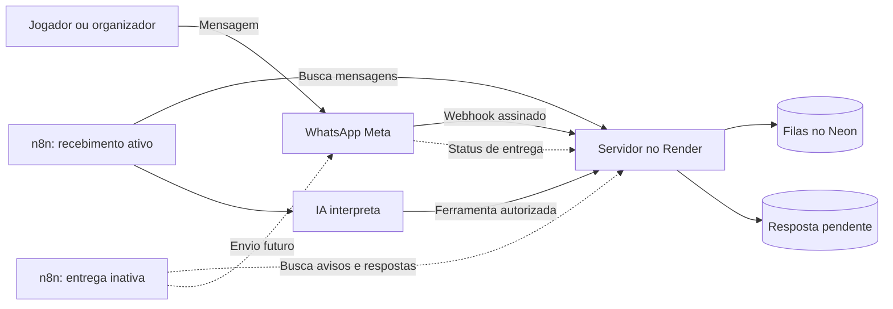

# Registro e plano de continuidade — IA e WhatsApp

## Número irlandês e Gupshup — 10/10/2026

A última falha do piloto Meta de teste foi **130497**. O diagnóstico apontou
restrições na conta/portfólio; ainda não houve resposta recebida pelo participante.
Não atribuir isso apenas à ausência de CNPJ ou ao cartão. O proprietário testa
como pessoa física e escolheu dedicar seu WhatsApp Business irlandês ao site.
Esse número não recebe SMS/ligação; foi vinculado e conectado pela coexistência,
com confirmação no próprio aplicativo, preservando seu acesso.

O proprietário criou a conta Gupshup, configurou MFA pessoalmente e completou
o cadastro incorporado. O painel mostra ToDentro Live, conta Active e telefone
Connected, além de pendência interna do MM Lite. Não foram comprovadas mensagens
entregues, e não houve recarga feita pelo agente.

Preparada a integração Gupshup v3: callback autenticado com segredo exclusivo,
App ID e Phone ID, piloto restrito e variante n8n de entrega separada. O executor
Meta não reserva entregas ao trocar o provedor. O caminho novo exige modo somente
respostas; convites e lembretes não são liberados. Áudio no novo transporte
ainda pede texto. Configuração remota, credenciais e teste real permanecem
pendentes; o transporte padrão continua Meta até alterar as variáveis.

**Continuar pelo [guia Gupshup](WHATSAPP-GUPSHUP.md):** primeiro configurar o
servidor e o callback, conferir uma consulta nova com envio desligado, depois
preparar credencial/fluxo e verificar custos antes do teste de entrega. Segredos
entram diretamente nos serviços, pelo proprietário. Depois validar presença,
criação, áudio e execução contínua. CAT automático é tarefa pendente para a
migração obrigatória do mecanismo legado até 31/03/2027.

Os registros abaixo são históricos.

## Token duradouro e retorno final da Meta — 10/10/2026

O proprietário criou e salvou pessoalmente um token de usuário do sistema,
com expiração **Nunca**, após aprovar os acessos ao app Tô Dentro e à conta
WhatsApp de teste. A consulta autenticada de modelos retornou HTTP 200;
convite e lembrete estão aprovados em pt_BR. O token continua sujeito a revogação.

O destinatário de teste foi verificado na Meta com a mesma identidade WhatsApp
vinculada ao site. As falhas anteriores foram destinatário fora da lista (131030)
e token temporário expirado (190/463). Depois da troca, uma consulta nova foi
processada, mas o proprietário ainda não recebeu a resposta. **Entrega real
continua pendente.**

O retorno final de falha pelo webhook agora conserva somente o código numérico
da Meta. Esse código aparece no diagnóstico privado do piloto, mesmo se o evento
chegar antes do resultado HTTP do envio. Descrições e conteúdo do webhook não
são armazenados. Resultados aceitos não ficam marcados com `INVALID_RESPONSE`;
entrega/leitura confirmadas limpam erros e não são rebaixadas por falhas tardias.
A alteração não reenvia falhas antigas nem libera convites ou lembretes.

Próximo passo: publicar esta correção, fazer uma consulta nova e verificar o
código final ou a entrega. Depois testar áudio, presença e criação com confirmação,
pausa/revogação e hospedagem contínua. Os registros abaixo são históricos.

## Piloto de respostas e diagnóstico de entrega — 10/10/2026

O proprietário renovou a credencial da Meta e permitiu os domínios de API e
mídia necessários. Convite e lembrete foram conferidos como aprovados, em pt_BR.
O Render está com automação, envio e modo somente respostas habilitados para
um único número de piloto. O fluxo de entrega foi publicado no n8n local.
Convites e lembretes continuam bloqueados pelo modo somente respostas.

A consulta real chegou, foi processada e gerou uma resposta. O proprietário
informou que ainda não recebeu essa resposta. **Entrega real ainda não validada.**
O painel do grupo não inclui respostas de consultas gerais sem grupo associado.
O diagnóstico privado do executor passa a mostrar estados e códigos de falha
das respostas nas últimas 24 horas, incluindo essas consultas. Não mostra
conteúdo, telefones, credenciais ou identificadores de mensagens, nem reserva,
reenvia ou altera a fila. Códigos desconhecidos são agrupados em `OTHER`.

Próximo passo: consultar esse diagnóstico e corrigir a causa observada antes
de repetir o teste. Depois validar áudio, presença e criação com confirmação,
pausa e revogação, e definir hospedagem contínua do executor. Os registros
abaixo preservam o estado histórico de cada entrega.

## Correção do microfone para agente — 09/10/2026

O proprietário confirmou que o gravador funcionou, mas pediu que o agente
conduzisse tarefas, em vez de exigir transcrição manual. O botão flutuante passa
a abrir conversa por áudio/mensagem com consulta, proposta de criação e presença.
Respostas complementam o contexto; operações usam confirmação no próprio chat.
O site reutiliza a OpenAI do Render e ferramentas do backend, sem depender de
n8n para esta conversa. n8n continua responsável pelo canal WhatsApp.
Detalhes, limites e retenção: [ASSISTENTE-VOZ.md](ASSISTENTE-VOZ.md).

O novo código não habilita envios Meta nem campanhas e não adiciona assinatura.
Teste com áudio real da primeira entrega foi confirmado pelo proprietário;
validação do novo fluxo conversacional com o provedor real será feita após publicar.

## Entrega de áudio e texto — 09/10/2026

O proprietário retirou conversa/ligação ao vivo do escopo. Foi implementada a
primeira versão de gravação e transcrição revisável no site, processamento de
áudios no n8n e modo opcional somente de respostas. Consulte
[ASSISTENTE-VOZ.md](ASSISTENTE-VOZ.md) para recursos, limites e ativação.

As novas flags estão desligadas por padrão. O estado remoto registrado abaixo
permanece até a ativação pelo proprietário. Testes locais não equivalem a áudio
real na conta OpenAI ou envio real pela Meta. Oferta paga permanece pendente.

O restante deste documento preserva o registro anterior do piloto.

Atualizado em **09/10/2026**, no fuso de São Paulo. Este é o registro de estado
do piloto; o [plano original](PLANO-ASSISTENTE-E-WHATSAPP.md) preserva o desenho
da implementação e os guias técnicos detalham a execução.

**Estado:** assistente do site funcionando, número vinculado e agente n8n
recebendo mensagens reais. Uma consulta ao grupo Teste foi interpretada pela IA,
acionou o servidor e gerou uma resposta na fila. **A entrega pelo WhatsApp está
desligada.** Os modelos de convite e lembrete ainda aguardavam análise da Meta
na última verificação registrada.

**Autenticação Meta restabelecida em 09/10/2026:** após o proprietário conferir
e salvar novamente o campo Value, a consulta autenticada retornou HTTP `200`,
sem erro da Meta. Os dois modelos continuam `PENDING`, agora confirmados por
essa consulta bem-sucedida. Próxima dependência: aprovação dos modelos e
conferência final antes de liberar entrega somente para o número do piloto.

Durante a renovação, foram observados token expirado (`401 / 190 / 463`) e,
na primeira substituição, erro de contexto/autenticação (`403 / 200`, classificado
como `APP_ID_NOT_RESOLVED`). A consulta de permissões não foi concluída
(`400 / 2500`). Não foi necessário ampliar permissões. O segredo não foi lido
ou registrado; somente o proprietário realizou a substituição.

## Objetivo e decisões

O jogador recebe uma pergunta sobre a partida, responde pelo WhatsApp e sua
presença é atualizada no site. O organizador consulta a agenda e prepara jogos
pela conversa, revisa o resumo e confirma a criação. Convites, lembretes,
autorizações, falhas e pausa ficam disponíveis no Tô Dentro.

| Tema | Decisão tomada |
| --- | --- |
| Site | Vercel, projeto existente `deivity/todentro-vercel-teste` |
| API | Render temporariamente; Vercel encaminha `/api/*` para esse servidor |
| Dados | Neon; nenhuma migração de banco nesta entrega |
| Interface | Angular standalone, signals, CSS próprio e português |
| IA do site | Interpretação estruturada, revisão e confirmação antes de criar |
| Agente WhatsApp | n8n interpreta; servidor mantém identidade, permissões e regras |
| Execução do piloto | n8n local; sem contratação de n8n Cloud e dependente deste computador ligado |
| Canal | Plataforma oficial da Meta com remetente de teste |
| Escopo autorizado | Grupo **Teste**, somente número do proprietário terminado em **7415** |
| Expansão | Somente após testes completos, consentimento e definição de custos/operação |

Telefones completos, e-mail pessoal, códigos, tokens e chaves ficam fora deste
registro versionado. Migrar o servidor inteiro para a Vercel é outra tarefa;
manter o Render disponível enquanto o site depender dele.

## Entregas e histórico

| Entrega | Resultado e limite da verificação |
| --- | --- |
| Assistente no site | Implementado e configurado no Render; proprietário experimentou e confirmou funcionamento. Prepara proposta, permite edição e exige confirmação. |
| Meta | Conta/aplicativo configurados; nome ajustado para Tô Dentro; número de teste preparado. |
| Webhook | Callback no servidor, verificação configurada e inscrição do aplicativo na conta WhatsApp conferida. Recebimento real comprovado. |
| Vínculo | Código enviado pelo próprio WhatsApp e vínculo confirmado no site; fluxo de troca/desconexão implementado. |
| Autorizações | Convites e lembretes por jogador/grupo; preferências do proprietário conferidas no grupo Teste. |
| Agente | Consultas, presença e criação implementadas com ferramentas autorizadas do servidor. Presença/criação ainda precisam do teste completo com Meta real. |
| Filas | Entrada, respostas, avisos e eventos de entrega persistentes; reservas temporárias, deduplicação, limites e revalidação. |
| Operação no site | Ativação/pausa por grupo na Agenda, avisos e respostas de presença. Grupo Teste ativado. |
| n8n | Instalação local com banco próprio, separado do aplicativo; fluxos de recebimento e entrega configurados. |
| Credenciais | OpenAI, integração com servidor e Meta configuradas e vinculadas aos nós, sem valores no Git. |
| Modelos | `todentro_convite_piloto` e `todentro_lembrete_piloto`, idioma `pt_BR`, submetidos à Meta; análise pendente. |
| Diagnóstico | Rota privada autenticada com flags/contagens; não retorna mensagens, identidades ou segredos, nem consome comandos. |
| Consulta real | IA acionou ferramenta do sistema, fluxo concluiu com sucesso e resposta ficou na fila. Nenhuma entrega ao WhatsApp comprovada nesta etapa. |

- **08/10/2026:** assistente do site, vínculo e preparação do agente/fluxos locais.
- **[PR #24](https://github.com/DeivityAndrade/PeladaFutebol/pull/24):** agente,
  filas e operação incorporados à `main`; interface publicada na Vercel e API
  atualizada no Render.
- **09/10/2026 — [PR #25](https://github.com/DeivityAndrade/PeladaFutebol/pull/25):**
  diagnóstico incorporado à `main` e rota verificada no Render. Mudança de
  servidor, sem necessidade de nova publicação da interface.
- **09/10/2026:** grupo Teste ativado, recebimento publicado e credenciais
  verificadas. Avisos apareceram como agendados, sem envio.
- **09/10/2026:** formato do número corrigido no filtro do piloto; nova mensagem
  recebida e processada pela IA, mantendo entrega desligada.
- **09/10/2026 — continuação:** consulta de modelos encontrou token Meta
  expirado (`401 / 190 / 463`); renovação pendente, sem tentativa de envio.
- **09/10/2026 — após substituição salva:** consulta retornou erro de
  autenticação/contexto do aplicativo (`403 / 200`), sem envio. Conferência
  privada do formato e origem do token solicitada ao proprietário.
- **09/10/2026 — conferência concluída:** proprietário salvou novamente;
  consulta autenticada retornou `200`, sem erro. Convite e lembrete continuam
  `PENDING` em `pt_BR`. Nenhuma mensagem enviada.

### Correção do identificador do WhatsApp

A Meta confirmou esse número sem o nono dígito, enquanto a lista inicial usava
a forma digitada com esse dígito. O filtro comparava identificadores diferentes
e descartava a mensagem antes da fila. O proprietário ajustou somente
`WHATSAPP_PILOT_NUMBERS` para a forma confirmada e publicou no Render.

O diagnóstico passou a mostrar um vínculo exato, um grupo habilitado e ID do
remetente Meta correspondente. Nenhuma conta foi unida nem outro destinatário
liberado. Foi necessário novo envio, pois a mensagem descartada não seria
recuperada. Manter esse formato confirmado em futuras configurações.

### Evidências concluídas

- Última verificação completa do backend: **118 testes Java sem falhas**,
  incluindo **18 do agente**, com PostgreSQL local isolado.
- Compilação/empacotamento e CI das entregas aprovados; testes de navegador das
  áreas alteradas cobrem fluxos, erros, teclado e celular.
- Fluxos n8n testados com servidor, IA e Meta simulados, incluindo falha de IA,
  falha explícita da Meta e resultado incerto de transporte.
- Consultas reais autenticadas confirmaram acesso à Meta e inscrição do
  aplicativo na conta WhatsApp; acesso ao modelo OpenAI também confirmado.
- Diagnóstico após novo envio mostrou uma entrada `DONE` e uma resposta na
  janela consultada. Eventos da execução **53** mostram `Modelo econômico`,
  `Acionar sistema`, `Concluir mensagem` e sucesso do fluxo.

Isso comprova recebimento, geração pela IA e chamada ao sistema. Ainda não
comprova conteúdo exibido no WhatsApp, entrega/leitura, mudança de presença real
ou criação real de partida pelo chat. Os testes simulados não substituem essas
verificações. Não foi necessário ler textos privados das execuções para obter
as evidências acima.

## Estado operacional registrado

| Configuração | Estado |
| --- | --- |
| `WHATSAPP_AUTOMATION_ENABLED` | `true` no Render |
| `WHATSAPP_SEND_ENABLED` | `false` no Render |
| `WHATSAPP_PILOT_NUMBERS` | Um único identificador confirmado pela Meta, do proprietário terminado em 7415 |
| `WHATSAPP_INTEGRATION_TOKEN` | Configurado no Render e n8n; valor omitido |
| `todentro-inbox` | Publicado e ativo; consulta a cada minuto |
| `todentro-outbox` | Inativo |
| Grupo Teste | Automação ativada; preferências de convite/lembrete conferidas |
| IA do agente | OpenAI, modelo inicial `gpt-4.1-mini` |
| Credencial Meta do n8n | Renovada pelo proprietário e validada por consulta HTTP `200`, sem erro |
| Modelos Meta | Convite e lembrete em análise (`PENDING`) na última consulta |
| Dados de execução n8n | Fluxos configurados sem guardar resultados manuais, de sucesso ou erro |

Antes de ativar entrega, conferir no Render `PUBLIC_APP_URL`, versão Graph,
nomes dos modelos e `WHATSAPP_DAILY_SEND_LIMIT`. Limite inicial preparado: 20
tentativas/dia UTC, somando grupos e respostas; confirmar valor efetivo. Isso
limita volume, não garante teto em reais. IA também precisa de orçamento próprio.

O n8n nunca conecta diretamente ao banco do aplicativo. O servidor constrói
a resposta final e valida regras de presença, fila, autorização e criação.

## Próximas etapas e critérios de conclusão

### 1. Preparação da entrega — prioridade atual

- [x] No aplicativo Tô Dentro da Meta, gerar novo token com o mesmo escopo do
  piloto. No n8n, atualizar a credencial existente **Meta — WhatsApp**, mantendo
  Name `Authorization`, Value `Bearer ` seguido do novo token e domínio
  `graph.facebook.com`. O proprietário preenche e salva; não enviar o token
  na conversa nem alterar a chave OpenAI ou o token de integração do Render.
- [x] Validar a credencial renovada com consulta sem envio. A renovação no
  n8n não exige mudança de `WHATSAPP_INTEGRATION_TOKEN` no Render.
- [ ] Consultar análise dos dois modelos e registrar aprovação, idioma e
  categoria informados pela Meta. Se rejeitados, corrigir motivo e submeter.
- [ ] Conferir configuração efetiva do Render, ID do remetente, credencial Meta
  válida e único destinatário permitido no servidor e no painel Meta.
- [ ] Revisar avisos já pendentes: jogo, destinatário e validade; não liberar
  convites antigos ou duplicados apenas para acelerar teste.
- [ ] Com preparação concluída, ativar envio no Render e publicar o fluxo de
  entrega correto no n8n; conferir diagnóstico.

**Concluída quando:** entrega habilitada com modelos e destinatário corretos,
sem ampliar o piloto. Configurações de ambiente são feitas no painel pelo
proprietário; segredos não são enviados pela conversa.

### 2. Respostas e convites reais

- [ ] Fazer nova consulta pelo próprio WhatsApp para iniciar conversa recente;
  respostas antigas podem estar fora da janela válida.
- [ ] Conferir resposta recebida, grupo, jogo, horário e link.
- [ ] Receber convite com **Vou jogar / Não vou** para uma partida de teste
  identificada e previamente escolhida.
- [ ] Conferir aceitação pela API, evento de entrega e mensagem no dispositivo;
  aceitação sozinha não comprova entrega.
- [ ] Verificar ausência de duplicação em nova consulta do executor/webhook.

**Concluída quando:** ida e volta comprovada no número do piloto, com link
válido e resultados observáveis no site.

### 3. Presença pelo WhatsApp

- [ ] Responder **Vou jogar** e **Não vou**, conferindo entrada/saída no site.
- [ ] Testar “tô dentro” e “não vou conseguir”; resposta deve corresponder ao
  estado efetivo do jogo.
- [ ] Com várias partidas possíveis, pedir escolha antes de alterar presença.
- [ ] Verificar que jogador altera somente a própria presença; testar disputa
  de vaga/fila em ambiente isolado ou com voluntários autorizados.

**Concluída quando:** presença e resposta correspondem, com vagas, espera e
permissões preservadas.

### 4. Criação pelo organizador

- [ ] Solicitar partida com grupo, data, horário e local explícitos.
- [ ] Conferir resumo com data absoluta, fuso, times, vagas, recorrência e
  cobrança; proposta não deve criar jogo antes da confirmação.
- [ ] Confirmar pelo mecanismo mostrado e conferir criação única na agenda;
  repetir confirmação não deve duplicar.
- [ ] Testar informação ausente, ambiguidade e usuário sem permissão com dados
  de teste; esclarecer ou impedir criação conforme o caso.

**Concluída quando:** organizador cria uma vez após revisão e usuário comum
não cria; pedido ambíguo exige esclarecimento.

### 5. Lembretes, saída e recuperação

- [ ] Receber lembrete de partida de teste, com presença e autorização.
- [ ] Testar **SAIR**, desconexão do número e pausa do grupo; avisos pendentes
  devem deixar de ser elegíveis. Uma mensagem já submetida pode chegar.
- [ ] Testar alteração/cancelamento e invalidação dos avisos pendentes. Avisos
  novos de alteração/cancelamento exigem implementação/modelos próprios.
- [ ] Conferir credencial expirada, falha explícita e entrega incerta; não
  reenviar automaticamente quando a Meta pode já ter aceitado.
- [ ] Reiniciar executor e conferir retomada sem perder filas/duplicar ações.

**Concluída quando:** pausa respeitada, falhas visíveis e recuperação conhecida.

### 6. Operação contínua e expansão

- [ ] Definir orçamento mensal de IA, mensagens e infraestrutura a partir do
  volume/preços verificados na ocasião; conferir consumo efetivo do piloto.
- [ ] Escolher hospedagem contínua do n8n, armazenamento persistente, HTTPS,
  backups/restauração e credenciais adequadas.
- [ ] Garantir disponibilidade do servidor para a cadência escolhida, mantendo
  Render e Neon até uma eventual migração separada.
- [ ] Definir responsável por falhas e procedimento de pausa. Monitoramento
  precisa de configuração explícita; este documento não cria um monitor.
- [ ] Adicionar poucos participantes voluntários, um grupo por vez, com vínculo,
  autorizações e destinatários permitidos na Meta.
- [ ] Registrar resultados, custos e incidentes antes de ampliar novamente.

**Concluída quando:** não depende deste computador, orçamento conhecido,
recuperação testada e fluxos principais aprovados.

## Pausa e retomada

Para interromper novos envios, definir `WHATSAPP_SEND_ENABLED=false` no Render,
aguardar publicação e desativar entrega no n8n. Para um grupo, usar o controle
da Agenda. Para parar comandos também, desativar recebimento e automação do
servidor. Mensagens já submetidas à Meta não podem ser retiradas por essas ações.

Na retomada, revisar credenciais, modelos, destinatários, grupo e validade da
fila. Não duplicar registros nem reenviar entregas incertas. Formulário de jogo
e presença pelo site continuam disponíveis.

## Evoluções posteriores

- **Assistente por voz no site:** proprietário prefere conversa em tempo real,
  iniciada por microfone no canto da tela. Planejado, ainda não implementado.
  Prever áudio no WhatsApp e futura oferta paga com limites. Consulte
  [direção e plano de voz](ASSISTENTE-VOZ.md).
- Áudio/transcrição no WhatsApp, com autorização e limites próprios; mensagens
  de áudio e ligação em tempo real são escopos diferentes.
- Edição/cancelamento pela conversa, com revisão e confirmação.
- Modelos para avisar alterações/cancelamentos a quem já recebeu convite.
- Oferta de vagas liberadas respeitando fila e preferências.
- Atendimento humano e dúvidas fora das ferramentas do agente.
- Cobranças e operações financeiras: projeto separado, sem pagamentos
  automáticos neste piloto.

## Guias de manutenção

- [Assistente do site](ASSISTENTE.md): uso, configuração, limites e propostas.
- [Vínculo e autorização](WHATSAPP.md): Meta, webhook e revogação.
- [Agente e n8n](WHATSAPP-AGENTE.md): instalação, credenciais, modelos,
  contratos, retenção e falhas.
- [Vercel](VERCEL.md): publicação no projeto existente.

**Ao continuar:** começar pela etapa 1 e verificar estado atual na Meta. Não
repetir configuração de chave ou vínculo já concluídos. Registrar data, cenário,
resultado real e limitações ao marcar cada etapa; nunca copiar dados privados
ou credenciais para o registro.
